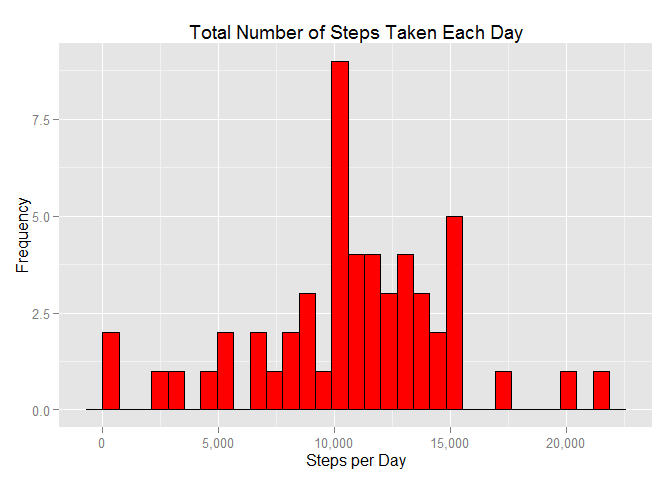

# Reproducible Research: Peer Assessment 1


## Loading and preprocessing the data


```r
library(dplyr)
```

```
## Warning: package 'dplyr' was built under R version 3.2.1
```

```
## 
## Attaching package: 'dplyr'
## 
## The following objects are masked from 'package:stats':
## 
##     filter, lag
## 
## The following objects are masked from 'package:base':
## 
##     intersect, setdiff, setequal, union
```

```r
library(ggplot2)
```

```
## Warning: package 'ggplot2' was built under R version 3.2.1
```

```r
library(scales)
```


## What is mean total number of steps taken per day?


```r
actDat <- read.csv("./activity.csv", colClasses = c("numeric", "Date", "numeric"))
actDay <- actDat %>% group_by(date) %>% summarize(Steps = sum(steps,na.exclude = TRUE))
p1 <- ggplot(data = actDay, mapping = aes(x = Steps)) + geom_histogram(fill = "red", 
    colour = "black") + scale_x_continuous("Steps per Day", labels = comma) + 
    scale_y_continuous("Frequency") + ggtitle("Total Number of Steps Taken Each Day")
p1
```

```
## stat_bin: binwidth defaulted to range/30. Use 'binwidth = x' to adjust this.
```

 
## The mean and median of the total number of steps taken per day are:

```r
mean(actDay$Steps,na.rm = TRUE)
```

```
## [1] 10767.19
```

```r
median(actDay$Steps,na.rm = TRUE)
```

```
## [1] 10766
```

## What is the average daily activity pattern?

```r
step_average <- actDat %>% group_by(interval) %>% summarize(average_step = mean(steps,na.rm = TRUE))

p2 <- ggplot(data = step_average,mapping = aes(x = interval, y = average_step))+geom_line()+ scale_x_continuous("Day Interval", breaks = seq(min(step_average$interval), 
    max(step_average$interval), 100)) + scale_y_continuous("Average Number of Steps") + 
    ggtitle("Average Number of Steps Taken by Interval")
p2
```

 

## Which day has the maximium average number of steps 

```r
max_interval <- which.max(step_average$average_step)
actDat[max_interval,]
```

```
##     steps       date interval
## 104    NA 2012-10-01      835
```
We have 288(60*24/5) intervals per day in total, so the max happens at 104th interval, around 8:35AM. 

## Imputing missing values

### Total number of missing values in the dataset are: 

```r
sum(is.na(actDat$steps) )
```

```
## [1] 2304
```

### Use mean/median for that day to replace all NAs in that day

```r
actDat2 <- actDat %>% left_join(step_average, by = "interval")
actDat2$steps <- ifelse(is.na(actDat2$steps), actDat2$average_step, actDat2$steps)
actDat2 <- select(actDat2,-average_step)
```

### repeate analysis above. It appears that the frequency plot shows some differences although mean/median does not change significantly

```r
actDay <- actDat2 %>% group_by(date) %>% summarize(Steps = sum(steps))
p3 <- ggplot(data = actDay, mapping = aes(x = Steps)) + geom_histogram(fill = "red", 
    colour = "black") + scale_x_continuous("Steps per Day", labels = comma) + 
    scale_y_continuous("Frequency") + ggtitle("Total Number of Steps Taken Each Day")
p3
```

```
## stat_bin: binwidth defaulted to range/30. Use 'binwidth = x' to adjust this.
```

 

```r
mean(actDay$Steps,na.rm = TRUE)
```

```
## [1] 10766.19
```

```r
median(actDay$Steps,na.rm = TRUE)
```

```
## [1] 10766.19
```

## Are there differences in activity patterns between weekdays and weekends?

```r
library(lubridate)
```

```
## Warning: package 'lubridate' was built under R version 3.2.1
```

```r
actDat2$weekend <- ifelse(wday(actDat2$date) %in% c(6:7),"weekend","weekday")

actDay <- actDat2 %>% group_by(interval,weekend) %>% summarize(average_step = mean(steps,na.rm = TRUE))
p4 <- ggplot(data = actDay,mapping = aes(x = interval, y = average_step))+geom_line()+facet_grid(weekend~.)+ scale_x_continuous("Day Interval", breaks = seq(min(actDay$interval), 
    max(actDay$interval), 100)) + scale_y_continuous("Average Number of Steps") + 
    ggtitle("Average Number of Steps Taken by Interval")
p4
```

 

